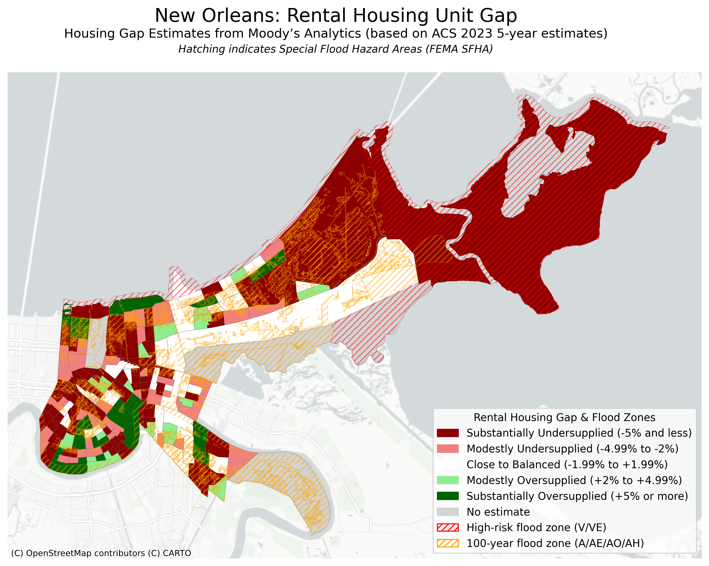

# Command-Line GIS Final Project  
## Airbnbs in New Orleans  

**Author:** Sina-Marie Mayer
**Course:** Command-Line GIS  

---

## 1. Overview
This project visualizes Airbnb affordability, rental housing gaps, and flood risk in New Orleans. It includes:  

- **Static Map 1:** Airbnb Affordability Ratio per census tract  
- **Static Map 2:** Rental Housing Unit Gap & Flood Zones  
- **Interactive Webmap:** Combines Airbnb listings, affordability choropleth, flood zones, and transit buffers  

---

## 2. Static Maps

### Static Map 1: Airbnb Affordability Ratio
Shows the **median nightly Airbnb price relative to median daily income**.

 

---

### Static Map 2: Rental Housing Unit Gap & Flood Zones
Overlays the **rental housing unit gap** with **FEMA Special Flood Hazard Areas (SFHA)**.

 

---

## 3. Interactive Webmap
This interactive map includes:  

- **Affordability Ratio Choropleth**  
- **Airbnb Listings** (marker cluster)  
- **Airbnb Heat Map**  
- **Flood Zones (SFHA)**  
- **Quarter-mile Transit Buffers**  
- **Transit Routes & Stops**  

<iframe src="nola_Airbnbs.html" height="855" width="95%"></iframe>  

Or view it as a **separate web page**: [nola_Airbnbs.html](nola_Airbnbs.html)

---

## 4. Data Description

### Datasets Used

#### Airbnb Data
- **Source:** Inside Airbnb  [https://insideairbnb.com/get-the-data/] 
- **Last updated:** 09/11/2025  
- **Original format:** CSV, with latitude/longitude coordinates  
- **Processing:** Converted coordinates to shapely geometry; aggregated listings to census tracts; calculated affordability ratio (median nightly price / median daily income).

#### Tract Geometries
- **Source:** NHGIS  [https://www.nhgis.org/]
- **Original format:** Shapefiles within ZIP archive
- **Processing:** Filtered to Orleans Parish

#### Census Data (Income & Housing)
- **Source:** American Community Survey (ACS) 2023 5-year estimates API 
- **Original format:** CSV and shapefiles  
- **Processing:** Joined tabular income data to census tract geometries; calculated affordability ratios; handled missing or low-confidence estimates with hatching in static maps.  

#### Rental Housing Unit Gap
- **Source:** Moody’s Analytics, Reinvestment Fund, PolicyMap  [https://www.policymap.com/data/moodys-housing-shortfall]
- **Original format:** CSV with tract identifiers  
- **Processing:** Joined table to tract geometries. 

#### Flood Zones (SFHA)
- **Source:** FEMA National Flood Hazard Layer (NFHL)  [https://msc.fema.gov/portal/home ]
- **Last updated:** 09/30/2016
- **Original format:** Shapefiles within ZIP archives  
- **Processing:** Filtered for high-risk flood zones (V/VE) and 100-year zones (A/AE/AO/AH); simplified geometries for webmap.

#### Transit Routes & Stops
- **Source:** City of New Orleans Open Data [https://catalog.data.gov/dataset/truck-routes-fcf7e] & [https://data.nola.gov/Transportation-and-Infrastructure/RTA-Stops/hp2r-gr3h/about_data]  
- **Original format:** CSV for stops, shapefiles/GeoJSON for routes  
- **Processing:** Converted stops to points, created quarter-mile buffers, simplified geometries for web display.  

### Data Quality Issues
- Missing or low-confidence data in income or rental gap datasets (handled with hatching or “No estimate” coloring).  
- Some shapefiles needed projection adjustment and simplification to display correctly on webmap.  
- Airbnb data required aggregation to tract level to avoid overcrowding on static maps.

---

## 5. Credits
Created by **Sina-Marie Mayer** for **Command-Line GIS** (Bloustein School of Planning and Public Policy, Rutgers University, Fall 2025).  
Data sources: ACS, FEMA, Moody’s Analytics, New Orleans Open Data, NHGIS, PolicyMap, InsideAirbnb.  

